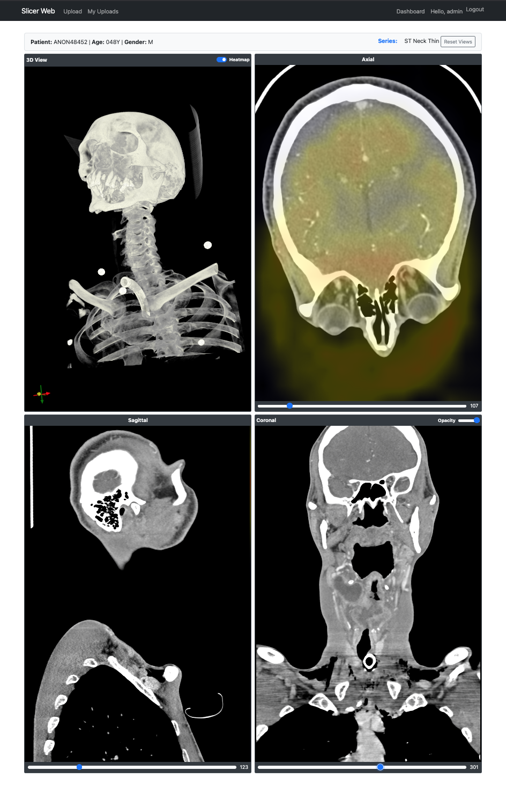

# Medical Imaging AI Dashboard (SlicerWebApp)

A powerful, web-based platform for managing, viewing, and analyzing medical imaging data (DICOM). This application integrates advanced 3D visualization with AI-powered analysis to assist researchers and clinicians in interpreting medical scans.


*(Replace with actual screenshot)*

## 🚀 Key Features

*   **DICOM Management**: Easily upload, organize, and manage patient DICOM series.
*   **Interactive Viewer**:
    *   **2D Slice Views**: Axial, Coronal, and Sagittal views with smooth scrolling.
    *   **3D Volume Rendering**: Interactive 3D reconstruction of the scan.
    *   **Windowing/Leveling**: Adjust contrast and brightness for better visibility.
*   **AI Analysis & Heatmaps**:
    *   **Automated Prediction**: AI model predicts probabilities (e.g., ECE risk).
    *   **Grad-CAM Heatmaps**: Visualizes the regions of interest driving the AI's decision.
    *   **Overlay Controls**: Toggle heatmaps on/off and adjust opacity directly on the viewer.
*   **Modern UI**: Dark-mode optimized, responsive design using Bootstrap 5 and custom CSS.

## 🛠️ Technology Stack

*   **Backend**: Python, Django 5.x
*   **Frontend**: JavaScript (ES6+), VTK.js (Visualization), Chart.js (Data Viz)
*   **AI/ML**: TensorFlow/Keras, NumPy, Scikit-image
*   **Database**: SQLite (Development) / PostgreSQL (Production ready)
*   **Build Tool**: Vite (for optimized frontend bundles)

## ⚙️ Installation & Setup

### Prerequisites
*   **Python 3.9+**
*   **Node.js 16+** & **npm**

### 1. Clone the Repository
```bash
git clone https://github.com/nirazghimire/Web_App_Development.git
cd Web_App_Development
```

### 2. Backend Setup (Django)
Create a virtual environment and install dependencies:
```bash
python -m venv venv
source venv/bin/activate  # On Windows: venv\Scripts\activate
pip install -r requirements.txt
```

Run migrations and start the server:
```bash
cd SlicerWebApp
python manage.py migrate
python manage.py runserver
```

### 3. Frontend Setup (Vite + VTK.js)
Install Node.js dependencies and build the bundle:
```bash
cd SlicerWebApp
npm install
npm run build
```
*Note: The `npm run build` command compiles `main.js` into `static/js/dist/vtk.bundle.js`, which is required for the viewer to function.*

## 📖 Usage

1.  **Access the App**: Open your browser and go to `http://127.0.0.1:8000/dicom/`.
2.  **Upload Scans**: Go to "My Uploads" and upload a folder containing DICOM files.
3.  **View & Analyze**: Click on a series to open the Dashboard.
    *   Use the sliders to navigate slices.
    *   Toggle "Heatmap" to see AI insights.
    *   Rotate the 3D view to explore the volume.

## 🤝 Contributing

Contributions are welcome! Please fork the repository and submit a Pull Request.

## 📄 License

This project is licensed under the MIT License.
